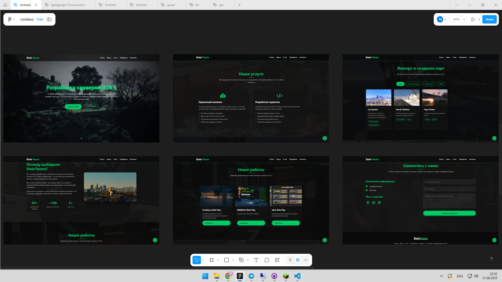

Полный отчёт о разработке сайта

1. Разработка дизайна в Figma
🔹 Инструмент: Figma

🔹 Этапы:

Создана структура: главная страница, форма обратной связи, адаптивные блоки.

Подобрана цветовая палитра:

Основной цвет: #0a0a0a

Акцентный: #00cc66 

Разработаны UI-элементы:

Кнопки, инпуты, карточки услуг.

Анимации для hover-эффектов.
🔹 Результат:
https://via.placeholder.com/800x500/2A4365/FFFFFF?text=SteinTeams+Figma+Design

2. Вёрстка сайта
🔹 Технологии:

HTML5 (семантическая разметка)

CSS3 (Flexbox, Grid, анимации)

JavaScript (для формы обратной связи)

🔹 Структура файлов:

syte-by-stein/
├── css/
│   ├── styles.css       # Основные стили
│   ├── responsive.css   # Медиазапросы
│   └── animations.css   # Анимации
|   └── contact_form.css # Стили обратной связи
|   └── components.css   # Стили Бэкграундов
├── img/                 # Изображения
├── js/
│   └── script.js        # Логика формы
├── index.html           # Главная страница
└── send_email.php       # Обработчик формы
🔹 Особенности:

Адаптивность под мобильные устройства (проверка на ios и android).

Интерактивная форма с валидацией полей.

3. Регистрация домена (бесплатно на 30 дней)
🔹 Сервис: No-IP
🔹 Действия:

Создал аккаунт.

Выбрал бесплатный поддомен: steinteams.zapto.org.

Установил No-IP Dynamic Update Client (DUC) для автоматического обновления IP.

⚠️ Важно:

Домен нужно подтверждать раз в 30 дней (придёт письмо).

4. Настройка XAMPP и размещение сайта
🔹 Действия:

Установил XAMPP (Apache + PHP).

Разместил файлы сайта в:

C:\xampp\htdocs\

Настроил виртуальный хост в httpd-vhosts.conf:

apache
<VirtualHost *:80>
    ServerName steinteams.zapto.org
    DocumentRoot "C:/xampp/htdocs"
    <Directory "C:/xampp/htdocs">
        Require all granted
    </Directory>
</VirtualHost>
Добавил домен в файл hosts для локальной проверки:

127.0.0.1 steinteams.zapto.org
🔹 Проверка:

Сайт открывается по http://steinteams.zapto.org (локально и из сети).

5. Настройка формы обратной связи
🔹 HTML-форма (в index.html):

html
<form id="contactForm" action="send_email.php" method="POST">
    <input type="text" name="name" placeholder="Имя" required>
    <input type="email" name="email" placeholder="Email" required>
    <textarea name="message" placeholder="Сообщение" required></textarea>
    <button type="submit">Отправить</button>
</form>

 <!-- Для статуса -->
🔹 Обработчик send_email.php:

Настроил отправку данных в Telegram через бота.

Использовал Telegram Bot API:

$botToken = 'ВАШ_ТОКЕН';
$chatId = 'ВАШ_CHAT_ID';
$url = "https://api.telegram.org/bot{$botToken}/sendMessage";

6. Настройка Telegram-бота
🔹 Действия:

Создал бота через @BotFather, получил токен.

Узнал chat_id через @userinfobot.

Настроил PHP-скрипт для отправки уведомлений.

🔹 Пример сообщения в Telegram:

plaintext
📢 Новая заявка!
Имя: Иван
Контакт: test@example.com
Сообщение: Привет! Хочу заказать сайт.

7. Проверка работы
🔹 Локально:

Форма отправляет данные → сообщение моментально приходит в Telegram.

Статус отображается в form-message.

🔹 Из интернета:

Домен steinteams.zapto.org доступен с любого устройства.

Форма корректно работает (если IP сервера актуален в No-IP).

Итог
✅ Что сделано:

Дизайн в Figma + адаптивная вёрстка.

Бесплатный домен steinteams.zapto.org.

Локальный сервер на XAMPP.

Форма обратной связи с уведомлениями в Telegram.
